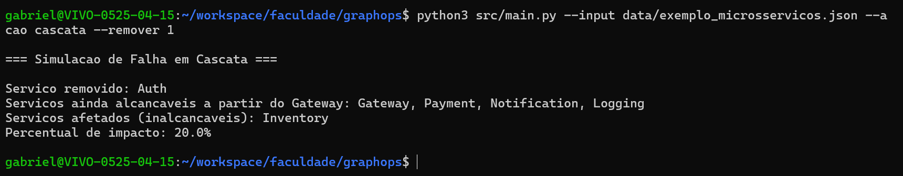
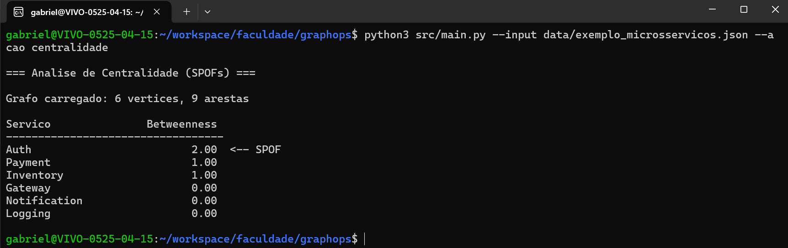

# E3 — MVP: Núcleo Funcional com Primeiras Telas

> **Disciplina:** Teoria dos Grafos  
> **Prazo:** 10 de maio de 2026  
> **Peso:** 25% da nota final  

---

## Identificação do Grupo

| Campo | Preenchimento |
|-------|---------------|
| Nome do projeto | GraphOps |
| Repositório GitHub | https://github.com/GabrielAndradeLourenco/graphops |
| Integrante 1 | Fernando Januário, RA 38772752 |
| Integrante 2 | Gabriel Andrade, RA 38332167 |

---

## 1. Como Executar o MVP

**Pré-requisitos:**

```bash
# Python 3.10 ou superior, sem dependencias externas
python3 --version
```

**Instalação:**

```bash
git clone https://github.com/GabrielAndradeLourenco/graphops.git
cd graphops
```

Não precisa instalar nada além do Python, o projeto usa só a biblioteca padrão.

**Execução:**

```bash
# ver quais servicos sao SPOFs
python3 src/main.py --input data/exemplo_microsservicos.json --acao centralidade

# simular a queda do Auth (id 1) e ver o impacto
python3 src/main.py --input data/exemplo_microsservicos.json --acao cascata --remover 1
```

**Saída esperada (centralidade):**

```
=== Analise de Centralidade (SPOFs) ===

Grafo carregado: 6 vertices, 9 arestas

Servico               Betweenness
----------------------------------
Auth                         2.00  <-- SPOF
Payment                      1.00
Inventory                    1.00
Gateway                      0.00
Notification                 0.00
Logging                      0.00
```

**Saída esperada (cascata):**

```
=== Simulacao de Falha em Cascata ===

Servico removido: Auth
Servicos ainda alcancaveis a partir do Gateway: Gateway, Payment, Notification, Logging
Servicos afetados (inalcancaveis): Inventory
Percentual de impacto: 20.0%
```

---

## 2. Algoritmo Implementado

| Campo | Resposta |
|-------|----------|
| Nome do algoritmo | Betweenness Centrality (algoritmo de Brandes) |
| Arquivo de implementação | `src/algorithms/betweenness.py` |
| Complexidade de tempo | O(V · E) |
| Complexidade de espaço | O(V + E) |

**Trecho do código com comentário de Big-O:**

```python
def calcular_betweenness(grafo):
    # O(V * E) no total: roda uma BFS pra cada vertice
    betweenness = {v: 0.0 for v in grafo.vertices()}

    for s in grafo.vertices():  # O(V) iteracoes
        pilha = []
        predecessores = {v: [] for v in grafo.vertices()}
        sigma = {v: 0 for v in grafo.vertices()}
        sigma[s] = 1
        distancia = {v: -1 for v in grafo.vertices()}
        distancia[s] = 0

        fila = deque([s])
        while fila:  # BFS: O(V + E) por execucao
            v = fila.popleft()
            pilha.append(v)
            for w in grafo.vizinhos(v):
                if distancia[w] < 0:
                    fila.append(w)
                    distancia[w] = distancia[v] + 1
                if distancia[w] == distancia[v] + 1:
                    sigma[w] += sigma[v]
                    predecessores[w].append(v)

        delta = {v: 0.0 for v in grafo.vertices()}
        while pilha:  # acumulo de dependencias: O(V + E)
            w = pilha.pop()
            for v in predecessores[w]:
                if sigma[w] > 0:
                    delta[v] += (sigma[v] / sigma[w]) * (1 + delta[w])
            if w != s:
                betweenness[w] += delta[w]

    return betweenness
```

**Algoritmo secundário:** BFS pra simulação de falha em cascata.

- Arquivo: `src/algorithms/cascade.py`
- Complexidade de tempo: O(V + E)
- Complexidade de espaço: O(V)

---

## 3. Estrutura do Repositório

```
graphops/
├── docs/
│   ├── E1_template.md
│   ├── E2_template.md
│   ├── E3_template.md
│   └── arquitetura_e2.drawio.png
├── src/
│   ├── core/
│   │   └── graph.py
│   ├── algorithms/
│   │   ├── betweenness.py
│   │   └── cascade.py
│   ├── reader/
│   │   └── file_reader.py
│   └── main.py
├── tests/
│   ├── test_graph.py
│   ├── test_betweenness.py
│   └── test_cascade.py
├── data/
│   └── exemplo_microsservicos.json
├── .gitignore
└── README.md
```

**Desvios em relação ao E2:**

A pasta `src/io/` virou `src/reader/` porque `io` é um módulo nativo do Python e causava conflito na hora de importar. A responsabilidade da camada é a mesma.

---

## 4. Telas do MVP

### Tela de Entrada

A interface é via CLI. O usuário passa o arquivo JSON com a topologia e escolhe a ação.



Parâmetros:
- `--input`: caminho do arquivo JSON
- `--acao`: `centralidade` ou `cascata`
- `--remover`: id do serviço a remover (só na cascata)

### Tela de Resultado



Na centralidade, o sistema exibe o ranking de serviços por betweenness e marca o SPOF. Na cascata, mostra quais serviços ficam inacessíveis e o percentual de impacto.

---

## 5. Testes Unitários

| Algoritmo | Caso de teste | Status | Comando para executar |
|-----------|--------------|--------|----------------------|
| Betweenness | Caso base | ✅ | `python3 -m unittest tests.test_betweenness.TestBetweenness.test_caso_base` |
| Betweenness | Grafo vazio | ✅ | `python3 -m unittest tests.test_betweenness.TestBetweenness.test_grafo_vazio` |
| Betweenness | Grafo completo | ✅ | `python3 -m unittest tests.test_betweenness.TestBetweenness.test_grafo_completo` |
| Cascade (BFS) | Caso base | ✅ | `python3 -m unittest tests.test_cascade.TestCascade.test_caso_base` |
| Cascade (BFS) | Grafo vazio | ✅ | `python3 -m unittest tests.test_cascade.TestCascade.test_grafo_vazio` |
| Cascade (BFS) | Grafo completo | ✅ | `python3 -m unittest tests.test_cascade.TestCascade.test_grafo_completo` |

**Como rodar todos os testes:**

```bash
python3 -m unittest discover tests
```

**Resultado:**

```
.........
----------------------------------------------------------------------
Ran 9 tests in 0.000s

OK
```

---

## 6. Histórico de Commits

| Hash | Mensagem | Autor |
|------|----------|-------|
| a preencher | feat: adiciona classe Graph com lista de adjacencia | Gabriel |
| a preencher | feat: implementa Betweenness Centrality e BFS de cascata | Gabriel |
| a preencher | feat: leitura de grafo a partir de JSON | Gabriel |
| a preencher | feat: CLI do MVP com acoes centralidade e cascata | Gabriel |
| a preencher | feat: adiciona grafo de exemplo de microsservicos | Gabriel |
| a preencher | test: adiciona testes unitarios para os algoritmos | Gabriel |
| a preencher | docs: adiciona README, gitignore e documento E3 | Gabriel |

---

## 7. O que está funcionando / O que ainda falta

| Funcionalidade | Status | Observação |
|---------------|--------|------------|
| Classe do grafo | ✅ Completo | |
| Betweenness Centrality | ✅ Completo | |
| BFS de cascata | ✅ Completo | |
| Leitura de JSON | ✅ Completo | |
| CLI (entrada e resultado) | ✅ Completo | |
| Testes unitários | ✅ Completo | 9 testes passando |
| Geração de grafos aleatórios | 🔄 Parcial | Fica pro E4 |
| Exportação de resultados em JSON | 🔄 Parcial | Fica pro E4 |

---

## Checklist de Entrega

- [x] Repositório público e acessível
- [x] .gitignore configurado
- [x] README com instruções de execução do MVP
- [x] Algoritmo principal executando sem erros
- [x] Tela de entrada e tela de resultado demonstráveis
- [x] 3 testes unitários por algoritmo (caso base, grafo vazio, grafo completo)
- [x] ≥ 5 commits com prefixos semânticos (feat:, test:, docs:)
- [x] Ao menos 1 arquivo de grafo de exemplo em `data/`

---

*Teoria dos Grafos — Profa. Dra. Andréa Ono Sakai*
